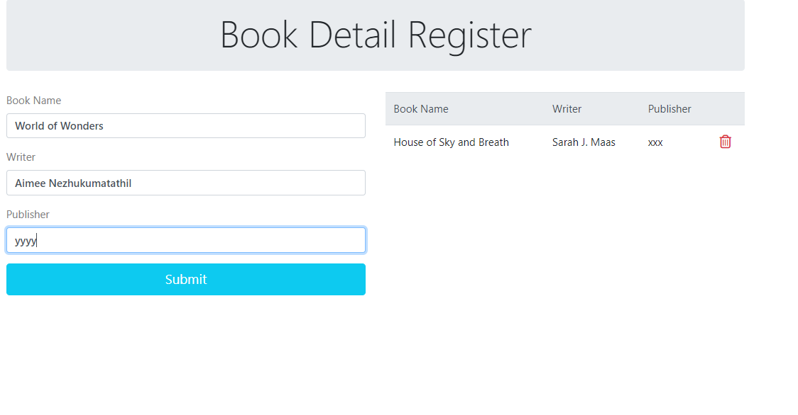
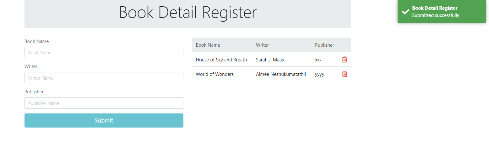
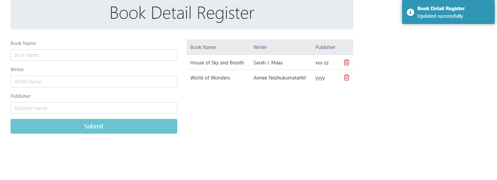
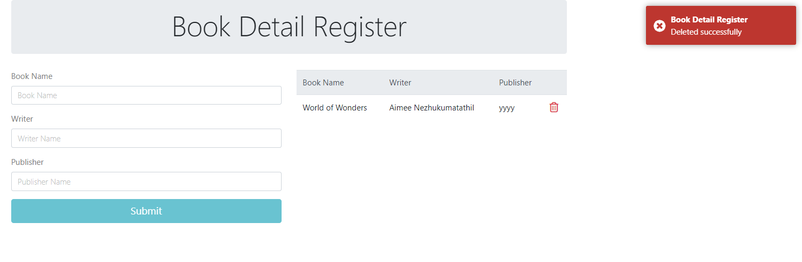

# BookMar
API with .net core and frontend with angularjs ,database is mssql (You can list,add,update, delete books)

This project was generated with [Angular CLI](https://github.com/angular/angular-cli) version 13.2.5.
 
 
## Listing and Add New Data
 
 

 
 

## Data Added With Succesful
 
 

 
 
## Select Data which you want edit, it fills the table then you can edit (xxx to xxx-zz)
 
 

 
 
## you can delete data
 
 

 
 
